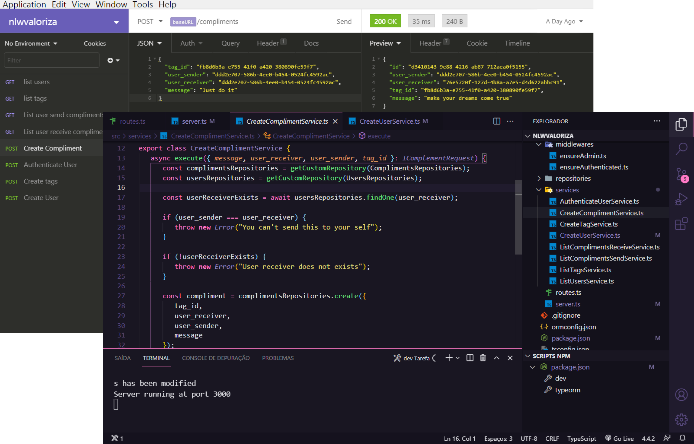
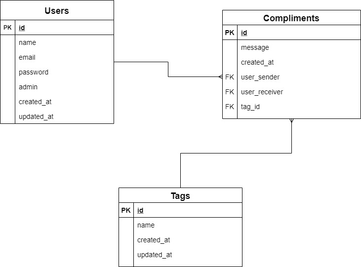

<h1 align="center">NLWAppreciate</h1>
<p align="center">Multi-level user app to register and give positive feedback to other users</p>

<p align="center"> 
 <a href="#Business rule">Business rule</a> • 
 <a href="#DER">DER</a> •
 <a href="#Tecnologies">Tecnologies</a> • 
 <a href="#Run the Project">Run the Project</a> • 
 <a href="#Tools">Tools</a> • 
 <a href="#New Features">New Features</a> • 
 <a href="#References">References</a> • 
</p>

<h1 align="center">
  
</h1>

# Business rule
## User register
- [x] It is not allowed to register more than one user with the same name
- [x] It is not allowed to register a user without an email

## TAG register
- [x] It is not allowed to register more than one **TAG** with the same name
- [x] It is not allowed to register a **tag** without a name
- [x] A "tag" can only be registered by administrator users

## Compliments register
- [x] An user cannot "compliment" himself
- [x] It is not allowed to register a "compliment" for an invalid user
- [x] The user must be authenticated in the app to "compliment"

# DER
<h1 align="center">
  
</h1>

# Tecnologies
* [Node.Js](https://nodejs.org/en/)
* [Express](https://expressjs.com/)
* [JsonWebToken](https://jwt.io/)
* [TypeORM](https://typeorm.io/#/)

# Run the Project
<p>Download the project or clone the repository</p>

```
git clone https://github.com/Lucas-Lameira/nlwappreciate.git
```
<p>Enter in the root folder and install the dependencies</p>

```
yarn install
```
<p>Now run the following script</p>

```
yarn dev
```

# Tools
Consider [postman](https://www.postman.com/) or [insomnia](https://insomnia.rest/download) to test routes <br>
SQL Editor and Database Manager [Beekeeper](https://www.beekeeperstudio.io/) 

# New Features
- [ ] Add a new Design Pattern like S.O.L.I.D or something
- [ ] Add email service
- [ ] Add error handling
- [ ] Add customizable errors
- [ ] Front-end
- [ ] Change sqlite to another database if you want

# References
This repository was created during an event made by [rocketseat](https://github.com/rocketseat-education) <br>
[NLW06 - official repository](https://github.com/rocketseat-education/nlw-06-nodejs)<br>
[Teacher: **danileao**](https://github.com/danileao)
